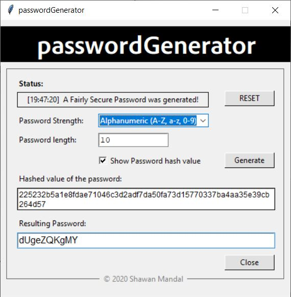

# passwordGenerator

passwordGenerator is a random password generator capable of generating large amounts of cryptographically-secure random passwords in three categories i.e. Alphabetic (A-Z, a-z), Alphanumeric (A-Z, a-z, 0-9) and Mixed Sequence Character passwords (A-Z, a-z, 0-9 and special characters/symbols)

## Requirements

Used modules:

```bash
import random                      # for generating random passwords
import sys                         # sys.exit() for exiting the program
from hashlib import sha256         #for password hash
from tkinter import *              # for GUI
from tkinter import Text
import tkinter as tk
from tkinter.ttk import Combobox
from tkinter import messagebox
from datetime import datetime      # for getting date time
```
## Note:
Install the font "AdobeClean-Bold.ttf" from the script folder before use

## Usage

Just run the main program and you can generate random passwords...! <br> <br>



## License
[MIT](https://choosealicense.com/licenses/mit/)
